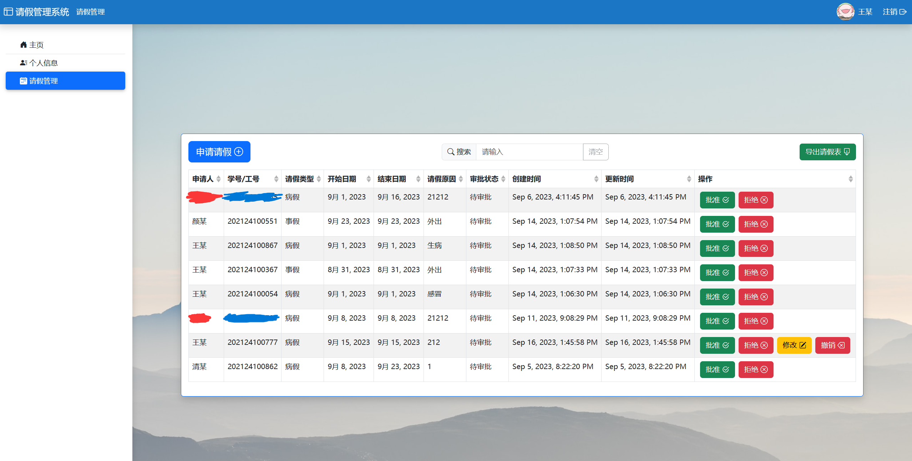

# 请假管理系统-后端

学生请假管理系统的后端部分

## 特色

- 支持登录、登出、修改密码等账号功能
- 支持身份区分（学生/辅导员）
- 支持请假的批准、拒绝、修改与撤销
- 不同学院的请假信息相互隔离
- 支持对请假条目模糊搜索
- 第二次自动登录
- 验证码登录
- 支持手机端访问
- 支持导出 excel 请假表

## 如何使用

请使用 Tomcat 部署

## 画廊

